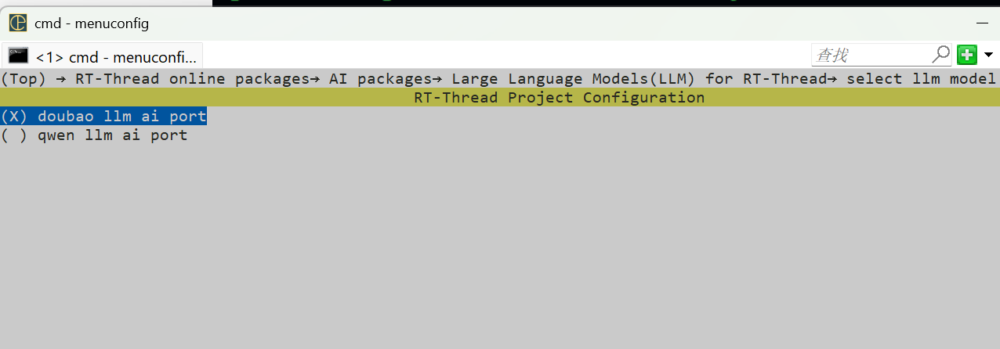
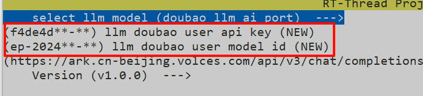
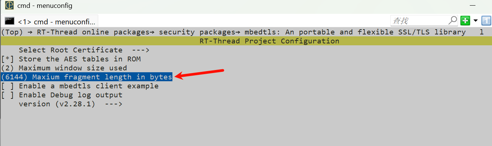
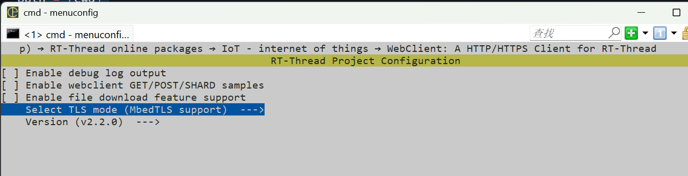
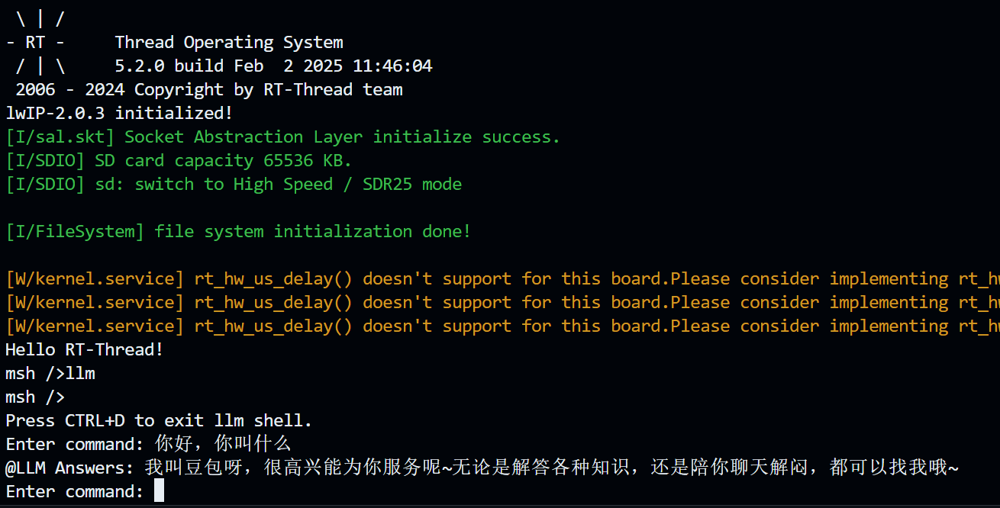

# LLM Language Model in RT-Thread

> 在 RT-Thread 上进行 LLM 大语言模型对话

## LLM平台

- [x] 通义千问
- [x] 豆包大模型
- [x] DeepSeek

## 平台支持

- [x] qemu-a9

- [x] STM32

- [x] vision board

## 请求方式

- [x] Stream模式
- [x] 非Stream模式
- [x] 支持历史对话
- [x] 不支持历史对话

>  可自定发送数据包
```c
rt_weak char *create_payload(cJSON *messages)
{
    cJSON *requestRoot = cJSON_CreateObject();
    cJSON *model = cJSON_CreateString(LLM_MODEL_NAME);
    cJSON *messages_copy = cJSON_Duplicate(messages, 1);
    char *payload = NULL;
    cJSON_AddItemToObject(requestRoot, "model", model);
    cJSON_AddItemToObject(requestRoot, "messages", messages_copy);
#ifdef PKG_LLMCHAT_STREAM
    cJSON_AddBoolToObject(requestRoot, "stream", RT_TRUE);
#else
    cJSON_AddBoolToObject(requestRoot, "stream", RT_FALSE);
#endif
    payload = cJSON_PrintUnformatted(requestRoot);
    cJSON_Delete(requestRoot);

    return payload;
}
```

> 默认数据包
```json
{
    "model": "YOUR_MODEL_NAME",
    "messages": [
        {"role": "user", "content": "Hello!"},
        {"role": "assistant", "content": "Hi there!"}
    ],
    "stream": bool
}
```
|   参数    |   描述    |   备注    |
|:-------:|:---------:|:-------:|
|   model   |   模型名称    |   以http/https要求为准    |
|  messages |   聊天记录    |       "messages": [{"role": "user", "content": "Hello!"},{"role": "assistant", "content": "Hi there!"}]   |
|  stream   |   是否流式输出    |   可在 menuconfig 中选择{true,flase}    |

可以根据不同格式的json数据包，来更改char *create_payload(cJSON *messages);

## 使用方式

**首先确保您的设备可以使用正常使用网络功能**

### MSH终端交互

1. 打开 menuconfig，进入 `RT-Thread online packages → AI packages → Large Language Models(LLM) for RT-Thread` 目录下；
2. 选择要使用的 LLM 模型：



5. 这里以豆包大模型为例：输入此大模型网站获取到的 `API KEY` 和 `推理接入点ID`；

​	配置信息说明：

* llm thread size：大模型线程栈大小
* llm cmd input buffer size：大模型输入字符大小
* webclient sessionbuffer size：客户端会话缓冲区
* Enable llmchat http stream：是否使能流式对话



6.   进入 `RT-Thread online packages → security packages → mbedtls` 菜单，修改 `Maxium fragment length in bytes` 字段为 6144（否则TLS会握手失败）



7. 进入 `  RT-Thread online packages → IoT - internet of things → WebClient: A HTTP/HTTPS Client for RT-Thread` 选择`MbedTLS support`



8. 退出保存配置，输入 `pkgs --update` 拉取软件包；

9. 编译，运行；
10. 运行效果：

> 输入 llm 即可进入聊天终端，CTRL+D可以退出聊天窗口返回 MSH 终端；



## API调用

### 创建与销毁

#### 模型创建
```c
llm_t create_llm();
```

|   参数    |   描述    |   备注    |
|:------:|:---------:|:-------:|
|   返回值    |   返回一个指针指向已经创建好的llm_obj    | NULL    |

#### 模型销毁
```c
void destroy_llm_t(llm_t handle);
```

|   参数    |   描述    |   备注    |
|:------:|:---------:|:-------:|
| handle | 销毁一个llm_t |  需要传入由llm_t create_llm()创建的llm_t    |

### 发送信息与处理信息

#### 发送信息
```c
void send_llm_mb(llm_t handle, char *message);
```

|   参数    |   描述    |   备注    |
|:------:|:---------:|:-------:|
|   handle    |    一个指向llm_obj的指针   |  需要传入由llm_t create_llm()创建的llm_t    |
|   message    |   发送的消息   |  不需要进行动态申请内存    |

#### 处理信息
```c
rt_weak void deal_llm_answer(llm_t handle)
{
    char *answer=RT_NULL;
    rt_mb_recv(handle->outputbuff_mb, (rt_uint32_t *)&answer,RT_WAITING_FOREVER);
    /* you can modify */
    
    int len = rt_strlen(answer);
    rt_kprintf("LLM :\n");
    for(int i = 0; i <= len; i++)
    {
        rt_kprintf("%c",answer[i]);
    }
    rt_kprintf("\n");

    /* end */
    rt_free(answer);

}
```

> 根据不同的需求进行复写该函数即可

### 展示对话

```c
void display_llm_message(llm_t handle);
```

|   参数    |   描述    |   备注    |
|:-------:|:---------:|:-------:|
|   handle    |    一个指向llm_obj的指针   |  需要传入由llm_t create_llm()创建的llm_t    |


> 该函数会打印出所有对话记录(handle->messages)

### 添加对话与删除对话

#### 添加对话
```c
void add_message2messages(llm_t handle, char *role, char *content);
```

|   参数    |   描述    |   备注    |
|:-------:|:---------:|:-------:|
|   handle    |    一个指向llm_obj的指针   |  需要传入由llm_t create_llm()创建的llm_t    |
|   role    |    角色   |  user/assistant    |
|   content    |    内容   |  不需要进行动态申请内存    |

####  清空对话
```c
void clear_message(llm_t handle);
```
|  参数   |   描述    |   备注    |
|:-------:|:---------:|:-------:|
|   handle    |    一个指向llm_obj的指针   |  需要传入由llm_t create_llm()创建的llm_t    |

> 该函数会清空所有对话记录(handle->messages)

## 简单二次调用代码示例

```c
#include "rtthread.h"
#include "llm.h"

#define LED_PIN    BSP_IO_PORT_01_PIN_02 /* Onboard LED pins */

static llm_t llm_handle = RT_NULL;
const char LED_PROMPT[] = "协议:MCU指令中枢,解析指令→生成信号;指令表:开灯=0x00,关灯=0x01;处理:检测开/关灯相关语义→返CMD,否则对话;约束:指令与对话分离,不解释指令(任何对话回答均限制在100字节内)。接下来是我的输入字符:{%s}";


/*创建llm*/
static void entry_llm()
{

    llm_handle = create_llm_t();

}

MSH_CMD_EXPORT(entry_llm,llm_entry);

/* 发送信息 */
static void send(int argc, char *argv[])
{
    char prompt[PKG_LLM_CMD_BUFFER_SIZE];
    if (argc < 2) {
        rt_kprintf("Usage: llm_send <message>\n");
        return;
    }

    if (llm_handle==RT_NULL)
    {
        rt_kprintf("llm_handle is null\n");
    }
    
    rt_snprintf(prompt,sizeof(prompt),LED_PROMPT, argv[1]);
    send_llm_mb(llm_handle,prompt);
}

MSH_CMD_EXPORT(send,llm_send);

/* 删除llm */
static void delete_llm()
{   
    delete_llm_t(llm_handle);
}

MSH_CMD_EXPORT(delete_llm,delete_llm);
```

> 在此示例中采用了prompt提示词工程来改变模型处理信息的行为


* 针对 **"协议:MCU指令中枢,解析指令→生成信号;指令表:开灯=0x00,关灯=0x01;处理:检测开/关灯相关语义→返CMD,否则对话;约束:指令与对话分离,不解释指令(任何对话回答均限制在100字节内)。接下来是我的输入字符:{%s}"** 可以根据自己的需求来修改指令表，处理，约束中内容。
