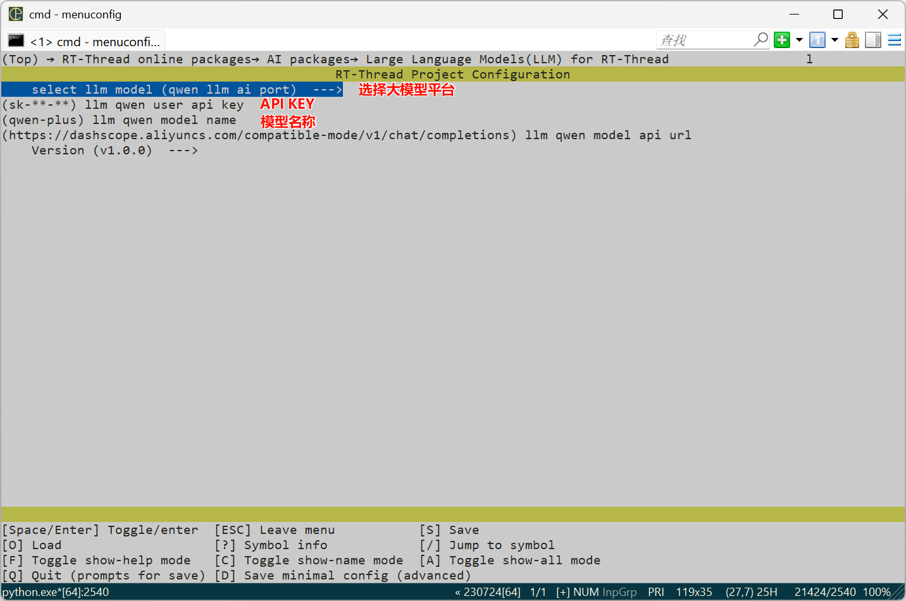

# LLM Language Model in RT-Thread

> 在 RT-Thread 上进行 LLM 大语言模型对话

## LLM平台

- [x] 通义千问
- [x] 豆包大模型

## 平台支持

- [x] qemu-a9

- [ ] STM32

## 使用方式

### MSH终端交互

#### 通义千问

1. 打开 menuconfig，进入 RT-Thread online packages → AI packages → Large Language Models(LLM) for RT-Thread 目录下；按照下图进行配置：

* llm qwen user api key：API KEY 需要在通义千问控制台获取
* llm qwen model name：选择模型的名称默认是 qwen-plus

2. 退出保存配置，输入 `pkgs --update` 拉取软件包

3. 编译

4. 运行效果：

   

#### 豆包大模型